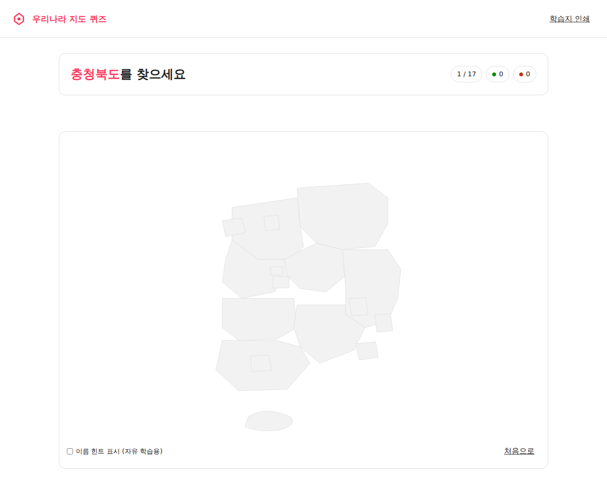

# Day 13 · 우리나라 지도 퀴즈 — 시·도 위치 맞추기

> **1일 1바이브코딩 챌린지 — Day 13/100** · 카테고리: 사회과 (4~6학년)

무작위로 제시되는 시·도(17개 광역)를 SVG 지도 위에서 클릭으로 맞추는 미니 웹앱. 받아쓰기 외부 자료·서버·로그인 없이 단일 HTML로 동작.

## 데모

GitHub Pages: https://989-alt.github.io/project-13-urinara-jido-kwijeu/

또는 로컬:
```bash
python3 -m http.server 5180 --bind 127.0.0.1
# → http://127.0.0.1:5180/index.html
```

## 핵심 기능

- **17 광역 시·도 클릭 퀴즈** — 서울/부산/대구/인천/광주/대전/울산/세종 + 경기/강원/충북/충남/전북/전남/경북/경남/제주.
- **무작위 출제** — 한 세션당 중복 없는 셔플.
- **즉시 채점 + 시각 피드백** — 정답 영역 초록 깜빡임 / 오답 빨강 + 정답 위치 노랑 외곽선.
- **결과 화면** — 정답률(%)·소요 시간·오답 목록 + **"오답만 재시험"** 모드.
- **이름 힌트 토글** — 자유 학습용으로 시·도 라벨 표시/숨김.
- **학습지 인쇄 모드** — A4 빈 지도(번호만)·하단 정답키, `@media print` 적용.
- **키보드 접근성** — Tab으로 path 순회, Enter/Space로 선택, focus-visible dashed outline.
- **`prefers-reduced-motion` 대응**.

## 실행 방법

요구사항 없음. 단일 `index.html`만 있으면 동작.

- 로컬: `index.html` 더블 클릭 (또는 `python3 -m http.server`)
- 배포: GitHub Pages (정적 호스팅 어디든 가능)

## 스크린샷



(추가 스크린샷: `tests/screenshots/` 참조 — 시작 / 진행 / 결과 / 인쇄 / 힌트 모드)

## 데이터 처리 정책

- **학생 정보 저장 0건** — localStorage·서버 모두 사용 안 함.
- **외부 API 호출 0건** — 오프라인 동작. Google Maps·Mapbox·Naver Maps 미사용.
- **AI 호출 0건** — Gemini 등 LLM 미사용 (토픽 특성상 불필요).

## 디자인

- **메인 브랜드**: [Airbnb](https://airbnb.com) — 흰 캔버스 + Rausch(#ff385c) single voltage CTA.
- **보조 브랜드**: Linear — 진행률 chip·결과 통계 단정한 정렬.
- **타이포**: system stack (Apple SD Gothic Neo / Pretendard / Noto Sans KR fallback) — CDN 폰트 의존 0.
- **접근성**: 색 대비 4.5:1 충족, aria-label 모든 path, aria-live="polite/assertive" 적용.

## 기술 스택

- 단일 `index.html` (HTML + vanilla CSS + vanilla JS)
- 빌드 도구 없음 · CDN 의존 0
- 17 시·도 SVG path 인라인 (단순화된 모식도)
- 테스트: Playwright (Python) e2e 9 케이스

## 테스트

```bash
# Playwright 설치 (1회)
pip install playwright && python3 -m playwright install chromium

# 실행
python3 tests/test_quiz.py
# → 9/9 PASS 기대
```

테스트 시나리오:
1. 시작 화면 로딩
2. 퀴즈 모드 진입
3. 17문제 전부 정답 → 100%
4. 오답 클릭 → 카운터 증가
5. 결과: 오답 목록 + 재시험 버튼
6. 오답만 재시험 → 100%
7. 학습지 인쇄 모드 (17 번호 + 정답키)
8. 힌트 토글 ON → 17 라벨 노출
9. console / pageerror 0건

## 한계

- SVG path는 정확한 행정구역 경계가 아닌 **단순화된 모식도**. 상대 위치·인접 관계 학습용. 정확한 측량 자료 학습이 필요하면 별도 학습지 병행.
- 광역시(서울/세종/대전/대구/광주)는 광역도(경기/충남/충북/경북/전남) 내부에 위치하므로 visual로 겹침. 사용자는 visible 영역을 보고 클릭해야 함.

## 적용한 skill

- `brainstorming` — MUST / SHOULD / MUST NOT 명세 (`docs/plans/01-brainstorm.md`)
- `ui-ux-pro-max` — Airbnb 디자인 시스템 차용 (`docs/plans/02-ui-ux.md`)
- `senior-devops` — 코드 품질 원칙 (CI/CD 부분은 본 토픽엔 미적용)
- `webapp-testing` — Playwright e2e (`tests/test_quiz.py`)

## 라이선스

교실 자유 사용 / 수정 / 재배포 허용.
